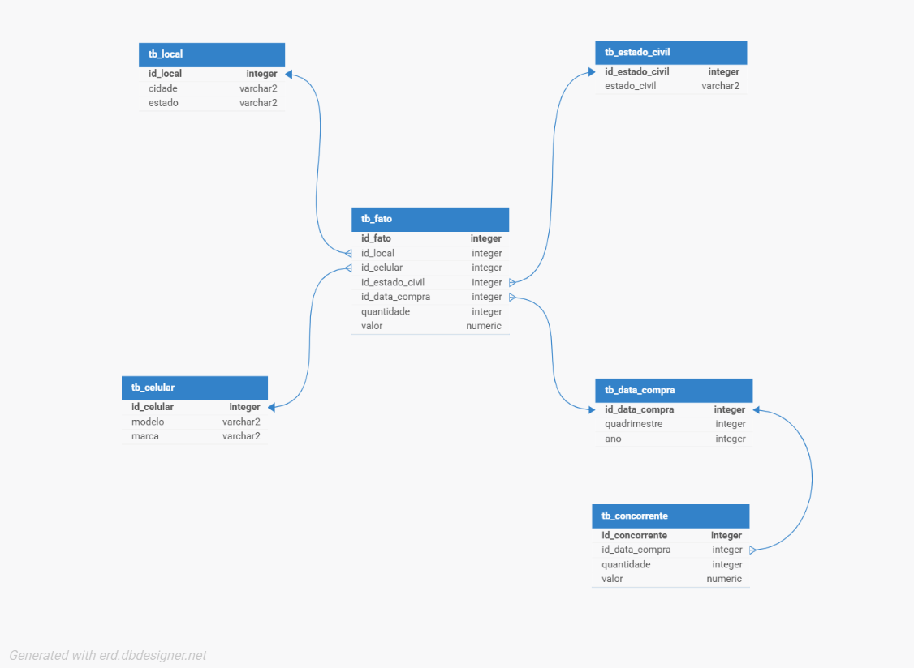

# Projeto de BI e Data Warehouse – Venda de Smartphones

## 📌 Visão Geral

Este projeto simula o trabalho de uma equipe de Business Intelligence (BI) responsável por estruturar e disponibilizar informações estratégicas para uma empresa fictícia do setor de vendas de smartphones.

O objetivo final é desenvolver um sistema completo de BI, desde a modelagem do Data Warehouse (DW), passando pela preparação dos dados com processos de ETL, até a construção das visualizações com base nas demandas recebidas.

---

## 🧱 Modelagem do Data Warehouse

O DW foi modelado utilizando o **modelo estrela (star schema)**, com uma tabela fato central e diversas tabelas dimensão relacionadas. A estrutura prioriza simplicidade e performance para consultas analíticas.

### Tabela Fato:
- `valor` (valor da venda)
- `quantidade` (unidades vendidas)

### Tabelas Dimensão:
- `tb_celular` – modelos e marcas de smartphones
- `tb_local` – cidade e estado
- `tb_estado_civil` – estado civil dos clientes
- `tb_data_compra` – quadrimestres e anos das compras

> Obs: Apesar da existência de uma tabela relacionada a concorrentes com ligação à dimensão de data, **o modelo não é snowflake**. Essa tabela serve apenas para fins comparativos.

---

## ⚙️ Processos de ETL

Os processos de **Extração, Transformação e Carga (ETL)** foram desenvolvidos utilizando **SQL puro**, com um script `.sql` para cada entidade envolvida no DW.

### Principais etapas:
- **Extração**: Dados foram obtidos do sistema OLTP original.
- **Transformação**: Aplicamos regras como junções, exclusão de duplicidades e geração automática de datas.
- **Carga**: Os dados tratados foram inseridos nas tabelas do DW.

### Exemplos:
- A tabela `tb_celular` é preenchida a partir da junção entre modelo e marca.
- A dimensão `tb_local` exclui entradas duplicadas como "SSA", "RJ" e "SP".
- A tabela `tb_data_compra` é preenchida com um loop de quadrimestres de 2020 a 2024.
- A carga da tabela fato consolida dados de compra, cliente, produto e localização.

Scripts relevantes disponíveis no repositório:
- `etl_celular_local.sql`
- `etl_local.sql`
- `etl_concorrentes.sql`
- `etl_estado_civil.sql`
- `etl_data.sql`
- `etl_fato.sql`

---

## 📊 Próximos Passos

Com os dados devidamente modelados e carregados, a próxima fase consiste na **construção do BI**. As visualizações e análises serão desenvolvidas com base nos dados disponíveis, seguindo as demandas definidas.

---

## 🧠 Considerações Finais

O projeto foi desenvolvido em equipe, simulando uma situação real de construção de solução analítica para uma empresa. Todas as etapas seguiram boas práticas de modelagem dimensional e organização de processos ETL.

A modelagem clara, a separação dos scripts e o foco na integridade dos dados facilitarão a etapa de visualização e entrega de insights estratégicos.

---

